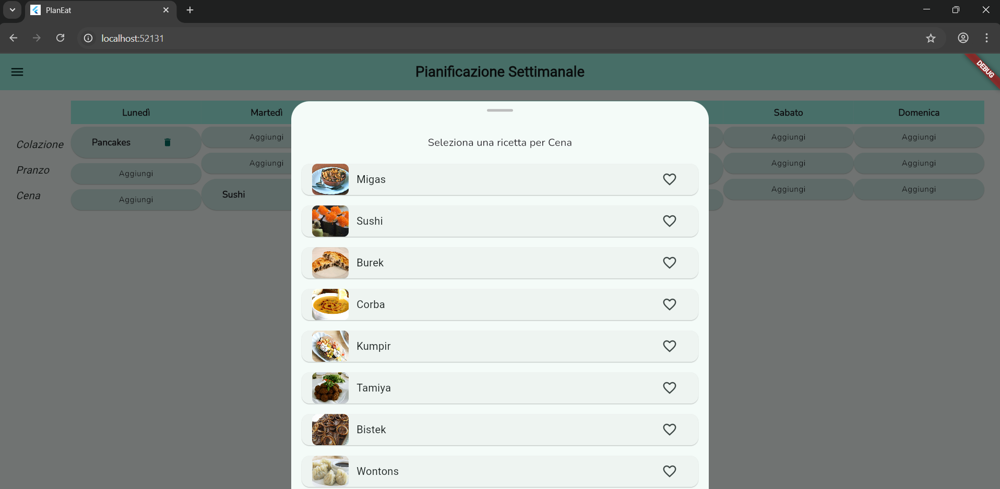

#  PlanEat-Weekly Meal Planner

## Autore
**Nome:** Galantini Edoardo
**N. Matricola:** 324692

## Descrizione del progetto
PlanEat è un’applicazione sviluppata con Flutter, pensata per aiutare gli utenti a pianificare i pasti della settimana in modo semplice e organizzato. L’app consente di assegnare ricette a ciascun pasto (colazione, pranzo e cena) per ogni giorno della settimana, memorizzare ricette preferite e generare automaticamente una lista della spesa in base alla pianificazione. L’interfaccia è responsive e ottimizzata 
soprattutto per mobile (Android) e desktop (Web).

## Esperienza utente
L’interfaccia principale mostra una griglia dei pasti organizzata per giorni della settimana. Ogni “slot” può essere toccato per aggiungere o modificare una ricetta attraverso un foglio di selezione. I pasti già selezionati possono essere rimossi con un tocco sull’icona del cestino.

Dal menu laterale (drawer), l’utente può accedere alle seguenti sezioni:
- **Planner:** per visualizzare e modificare la pianificazione settimanale.
- **Preferiti:** per vedere e gestire le ricette salvate come preferite.
- **Lista spesa:** per consultare e spuntare la lista della spesa generata in base ai pasti pianificati.

### Screenshot
#### 1. Web

   
   &nbsp;&nbsp;
   
   &nbsp;&nbsp;
   
   &nbsp;&nbsp;
   

#### 2. Mobile

   
   &nbsp;&nbsp;
   
   &nbsp;&nbsp;
   
   &nbsp;&nbsp;
   

## E. Tecnologia e implementazione
L'app è sviluppata interamente in **Flutter**. Sono stati utilizzati i seguenti pacchetti:

- **flutter_riverpod**: per la gestione dello stato globale. È stato usato in tutte le funzionalità principali (planner, ricette, preferiti).
- **go_router**: per la gestione della navigazione tra le schermate in modo semplice e dichiarativo.
- **google_fonts**: per personalizzare la tipografia dell’app utilizzando il font “Nunito”, rendendo l’interfaccia più moderna e leggibile.
- **http**: utilizzato per recuperare dinamicamente le ricette dal database pubblico **TheMealDB**.
- **shared_preferences**: per la persistenza locale dei dati dell’utente. È stato usato in tutte le funzionalità principali (planner, ricette, preferiti).

### Scelte progettuali degne di nota:
- **Integrazione API**: tutte le ricette provengono da una chiamata HTTP alle API di [TheMealDB](https://www.themealdb.com), decodificate e trasformate in oggetti `Recipe`.
- **Layout responsive**: il layout dell’interfaccia è suddiviso in componenti separati (`mobile_portrait`, `mobile_landscape`, `desktop_layout`) che vengono selezionati dinamicamente in base alla larghezza dello schermo e all’orientamento.
- **Organizzazione modulare del codice**: il progetto è strutturato per feature (`planner`, `recipes`, `favorites`, `shopping_list`), separando i layout, i modelli, i provider e le schermate per favorire manutenibilità e scalabilità.
- **State managent**: L'applicazione implenta un mix di `StateNotifierProvider` (per stati mutabili complessi come la pianificazione settimanale), `FutureProvider` (per lavorare con le API di TheMealDB) e `Provider` puro (come nel caso della lista della spesa), in base alla complessità del dato da gestire.

